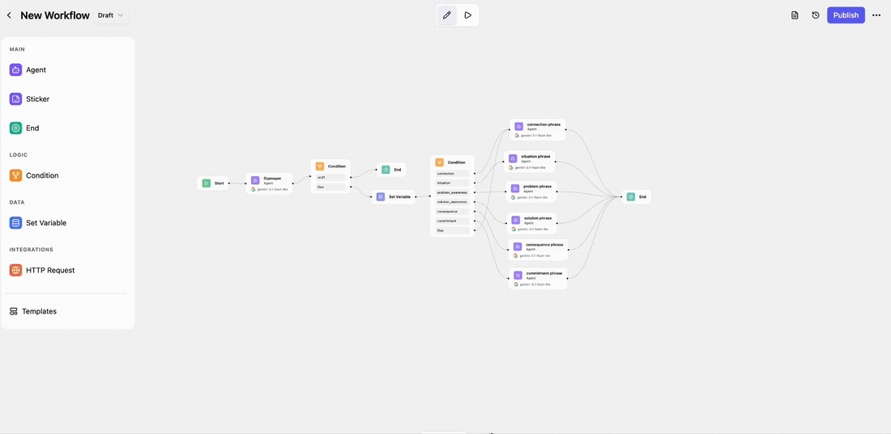
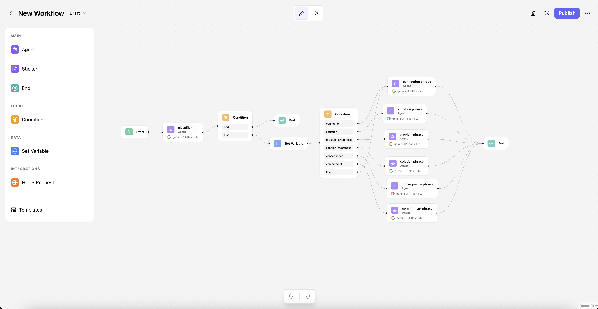
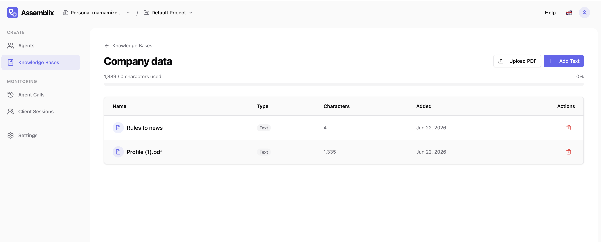
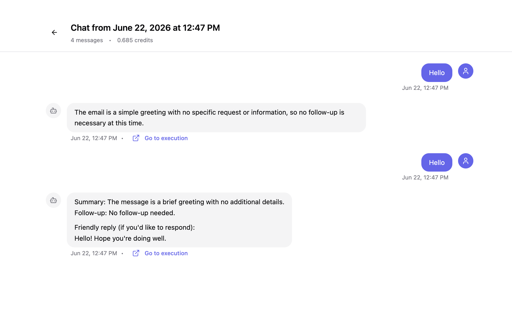
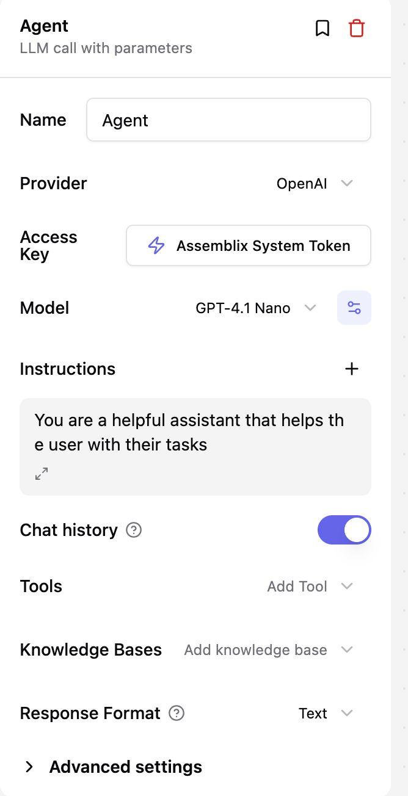
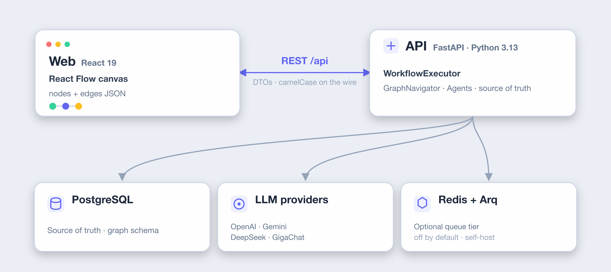

<div align="center">


### Build AI agents & automations — visually.

Drag nodes onto a canvas, wire them together, and ship a running AI workflow.
No glue code. Multi-LLM. Self-hostable. Source-available.

<!-- Badges -->
[](https://github.com/nmamizerov/assemblix/releases)
[](https://github.com/nmamizerov/assemblix/actions/workflows/ci.yml)
[](https://github.com/nmamizerov/assemblix/actions/workflows/web-ci.yml)
[][docs]
[](LICENSE.md)
[](https://github.com/nmamizerov/assemblix/stargazers)

**[▶ Try the live demo][demo]**  ·  **[📖 Documentation][docs]**  ·  **[🚀 Self-host](#-quickstart-1-minute)**  ·  **[⭐ Star us](https://github.com/nmamizerov/assemblix)**

<br/>

<!--
  HERO DEMO — the single most important asset on this page.
  Replace docs/assets/hero-placeholder.svg with the recorded GIF (docs/assets/hero.gif)
  once captured. See docs/assets/RECORDING.md for the shot list + processing pipeline.
-->
<a href="https://app.assmblx.com"></a>

</div>

---

**Assemblix** is a visual platform for building AI agents and workflow automations. You
compose workflows as directed graphs of nodes on a [React Flow](https://reactflow.dev)
canvas — `START → AGENT → CONDITION → HTTP_REQUEST → END` — then execute and monitor them
in real time. Agents can call any of several LLM providers, branch on logic, call out to
APIs, read from knowledge bases (RAG), and persist chat sessions. Run it on your own
infrastructure with a single `docker compose up`.

> **Source-available** (MIT + Commons Clause): free to use, modify, and self-host. The
> commercial billing/payments layer is under a separate Enterprise license and **off by
> default** — see [Licensing](#-license).

## Contents

- [✨ Why Assemblix](#-why-assemblix)
- [🧩 Features](#-features)
- [🚀 Quickstart (1 minute)](#-quickstart-1-minute)
- [📸 Screenshots](#-screenshots)
- [🧱 How it works](#-how-it-works)
- [📦 Use it: Demo · Self-host · Enterprise](#-use-it)
- [🔌 Write your own nodes](#-write-your-own-nodes)
- [🤝 Contributing](#-contributing)
- [🔭 Releases & versioning](#-releases--versioning)
- [💬 Community & support](#-community--support)
- [🔒 Security](#-security)
- [📄 License](#-license)

## ✨ Why Assemblix

- **Visual, not YAML.** Build agent logic by dragging and connecting nodes — see the whole
  flow at a glance, debug it node-by-node.
- **Bring your own model.** One canvas, many providers — OpenAI, Gemini, and DeepSeek —
  with retries, timeouts, and provider/model fallback built in.
- **Own your stack.** Self-host the entire thing with Postgres only; Redis + a worker queue
  tier are optional and opt-in. No vendor lock-in, no phone-home.
- **Production-minded.** SSRF-guarded HTTP node, secrets encryption, Prometheus metrics,
  health/ready probes, and rate limiting ship in the box.
- **Extensible by design.** Add a node type as a pip-installable package — it's
  auto-discovered, no core changes, no DB migration.

## 🧩 Features

| | |
|---|---|
| 🎨 **Visual canvas** | Drag-and-drop workflow editor (React Flow) with undo/redo, live debug panel, and per-node execution traces. |
| 🤖 **Multi-LLM agents** | `AGENT` nodes run tool-calling loops against OpenAI · Gemini · DeepSeek, with fallback and backoff. |
| 🔀 **Logic & control flow** | `CONDITION` (CEL expressions), `SET_VARIABLE`, and graph branching to build real decision logic. |
| 🌐 **HTTP & tools** | `HTTP_REQUEST` node with SSRF protection to call any external API as a tool. |
| 📚 **Knowledge bases (RAG)** | Attach document knowledge bases to agents for retrieval-augmented answers. |
| 🏢 **Multi-tenancy** | Organizations, projects, credentials, and chat sessions out of the box. |
| 📊 **Observability** | Prometheus `/metrics`, `/health` + `/ready` probes, in-flight executions, per-step LLM token/cost metrics. |
| 🔌 **Node SDK** | Register custom nodes via an entry-point group — auto-discovered at startup. |

<div align="center">

**Works with the model you already use**

<sub>OpenAI&nbsp;&nbsp;·&nbsp;&nbsp;Google Gemini&nbsp;&nbsp;·&nbsp;&nbsp;DeepSeek</sub>

</div>

## 🚀 Quickstart (1 minute)

You need [Docker](https://docs.docker.com/get-docker/) with Compose v2 — that's it. The
bootstrap script checks Docker, generates the two required secrets, writes the root `.env`,
and brings the whole stack up.

**One line — clone, configure, and launch:**

```bash
curl -fsSL https://raw.githubusercontent.com/nmamizerov/assemblix/main/install.sh | bash
```

This installs the **latest release tag** (a stable, frozen snapshot). To pin a specific
version or track `main`, set `ASSEMBLIX_REF`:

```bash
curl -fsSL .../install.sh | ASSEMBLIX_REF=v0.1.3 bash   # a specific release
curl -fsSL .../install.sh | ASSEMBLIX_REF=main    bash   # bleeding edge
```

It asks one question — **Авто** (zero-config lean prod) or **Подробно** (pick mode, ports,
the Redis+worker queue tier, UI language, and optional LLM keys) — then does the rest. When
it finishes, open **http://localhost:8080**, create an account, and build your first workflow.

**Already cloned the repo?** From the repo root:

```bash
make setup        # or: ./setup.sh   (./setup.sh --auto skips all prompts)
```

<details>
<summary><b>Manual setup, development stack (live reload), native setup, and the queue tier</b></summary>

<br/>

**Manual setup** (what the script automates) — there's a **single `.env` at the repo root**
for the whole stack:

```bash
git clone https://github.com/nmamizerov/assemblix.git
cd assemblix
cp .env.example.quick .env      # then fill in the two required secrets (see below)
docker compose up -d --build    # web → http://localhost:8080 · api → http://localhost:8000
```

Generate the two required secrets and paste them into `.env`:

```bash
# JWT_SECRET_KEY  (min 32 chars)
python3 -c "import secrets; print(secrets.token_urlsafe(48))"
# ENCRYPTION_KEY  (Fernet key)
python3 -c "from cryptography.fernet import Fernet; print(Fernet.generate_key().decode())"
```

The backend **fails fast** without a valid `JWT_SECRET_KEY` and `ENCRYPTION_KEY`.

<br/>

**Dev — full stack with hot reload** (web on `:5173`, api on `:8000`):

```bash
cp .env.example .env            # dev template (fill JWT_SECRET_KEY + ENCRYPTION_KEY)
docker compose -f docker-compose.dev.yml up --build
```

The root `Makefile` wraps the common commands: `make dev`, `make prod`, `make down`,
`make logs`, and `make check` (runs the quality gates of both apps).

**Run natively (no Docker for the apps)** — start just Postgres in Docker, run each app on
the host (both read the same root `.env`):

```bash
docker compose -f docker-compose.dev.yml up -d postgres

# Backend (from assemblix-app-api/) → :8000
cd assemblix-app-api && uv sync && uv run alembic upgrade head && make dev

# Frontend (from assemblix-app-web/) → :5173, proxies /api → :8000
cd assemblix-app-web && yarn install && yarn dev
```

**Optional Redis + worker queue tier** (off by default — single-Postgres self-host is the
default). To enable distributed execution, set in `.env`:

```bash
COMPOSE_PROFILES=queue
REDIS_URL=redis://redis:6379/0
EXECUTION_QUEUE_ENABLED=true
```

then `docker compose up -d`. Full configuration reference lives in the [docs][docs].

</details>

## 📸 Screenshots

| Visual canvas | Live execution & debug |
|:---:|:---:|
|  |  |
| **Execution traces & state** | **Knowledge bases (RAG)** |
|  |  |
| **Chat sessions** | **Agent configuration** |
|  |  |

## 🧱 How it works

<p align="center">
  
</p>

The frontend canvas produces the nodes-and-edges JSON; the backend is the source of truth
for the node-graph schema and executes it. Deep dive in the
per-app guides ([backend](assemblix-app-api/CLAUDE.md) · [frontend](assemblix-app-web/CLAUDE.md)).

## 📦 Use it

<table>
<tr>
<td width="33%" valign="top">

### ▶ Live demo
The fastest way to try it — no install.

**[Open the demo →][demo]**

</td>
<td width="33%" valign="top">

### 🚀 Self-host
One `docker compose up`, your infra, your keys.

**[Quickstart →](#-quickstart-1-minute)**

</td>
<td width="33%" valign="top">

### 🏢 Enterprise
Billing/payments layer (separate EE license), off by default.

**[Licensing →](#-license)**

</td>
</tr>
</table>

## 🔌 Write your own nodes

Nodes register by string type and are auto-discovered at startup via the `assemblix.nodes`
entry-point group — no core changes, no DB migration. New node types round-trip safely
through a generic schema fallback. See the
[node-authoring guide](internal-docs/CONTRIBUTING_NODES.md) for a worked example and packaging steps.

## 🤝 Contributing

Contributions are welcome — bug reports, features, docs, and new node types. Start with
[CONTRIBUTING.md](CONTRIBUTING.md) for setup, the quality gates (`make check`), and
conventions, and our [Code of Conduct](CODE_OF_CONDUCT.md). This project uses
[Conventional Commits](https://www.conventionalcommits.org) — see
[Releases & versioning](#-releases--versioning).

<a href="https://github.com/nmamizerov/assemblix/graphs/contributors">
  
</a>

## 🔭 Releases & versioning

Assemblix follows [Semantic Versioning](https://semver.org) with `vX.Y.Z` git tags and
[GitHub Releases](https://github.com/nmamizerov/assemblix/releases). Releases are automated
with [release-please](https://github.com/googleapis/release-please): merged
[Conventional Commits](https://www.conventionalcommits.org) on `main` keep a **release PR**
open that bumps the version (root manifest + `pyproject.toml` + `package.json` in lockstep)
and regenerates the [CHANGELOG](CHANGELOG.md); merging it cuts the tag and Release. Browse
or pin a version with `git checkout v0.1.0`, or via the **Releases** / **Tags** tab.

## 💬 Community & support

- 🐛 **Found a bug / want a feature?** Open an [issue](https://github.com/nmamizerov/assemblix/issues).
- 💡 **Questions & ideas:** [GitHub Discussions](https://github.com/nmamizerov/assemblix/discussions).
- 📖 **Docs:** [the documentation site][docs].

If Assemblix is useful to you, a ⭐ helps others find it.

<a href="https://star-history.com/#nmamizerov/assemblix&Date">
  
</a>

## 🔒 Security

Please report vulnerabilities privately — see [SECURITY.md](SECURITY.md). Do not open public
issues for security problems.

## 📄 License

Source-available under **MIT + Commons Clause** ([LICENSE.md](LICENSE.md)) — free to use,
modify, and self-host; you may not sell it or offer it as a paid hosted/managed service. A
small set of files (payments / acquiring) is under a separate **Enterprise license**
([LICENSE_EE.md](LICENSE_EE.md)) and is disabled by default for self-hosting
(`BILLING_ENABLED=false`). Third-party attributions are in [NOTICE](NOTICE).

<!--
  Reference links — the live demo + docs URLs live here in one place.
-->
[demo]: https://app.assmblx.com
[docs]: https://app.assmblx.com/docs
