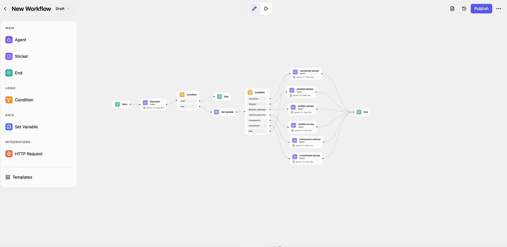
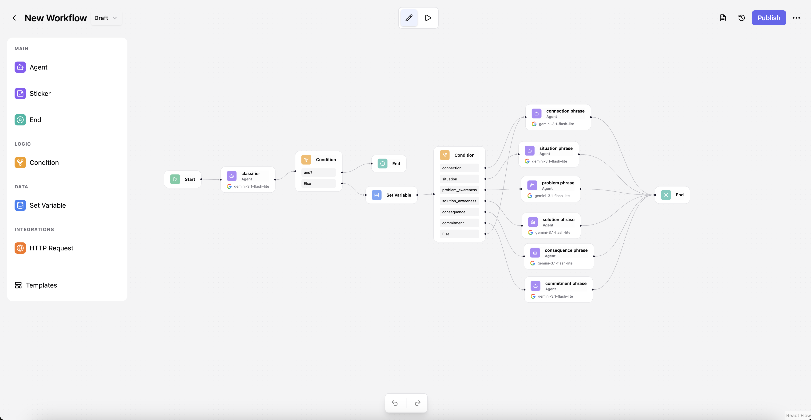
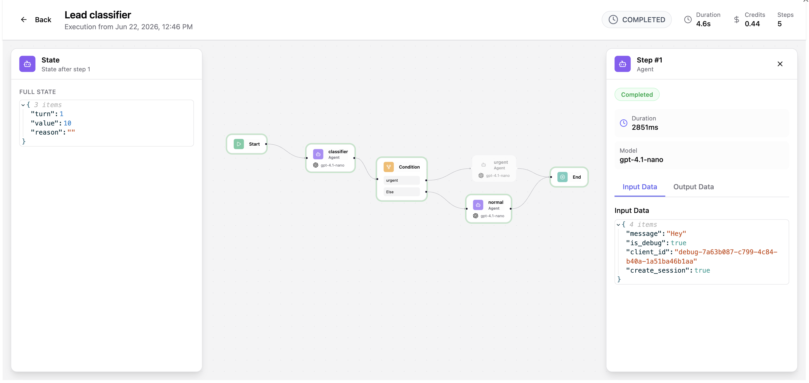
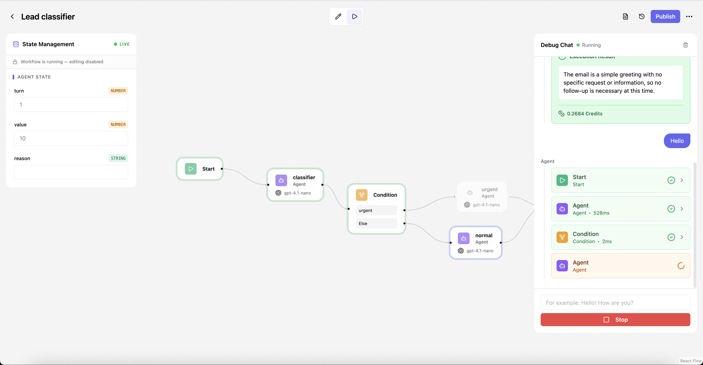
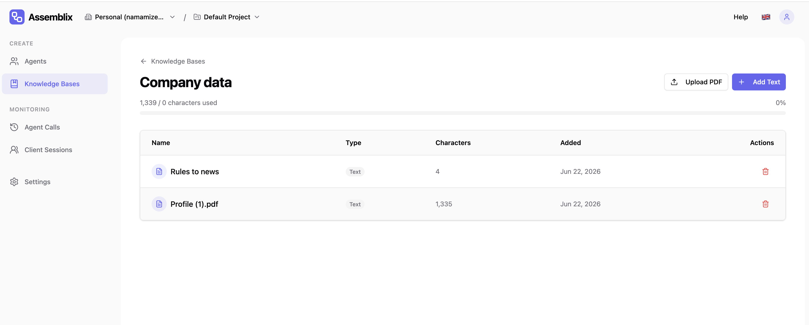
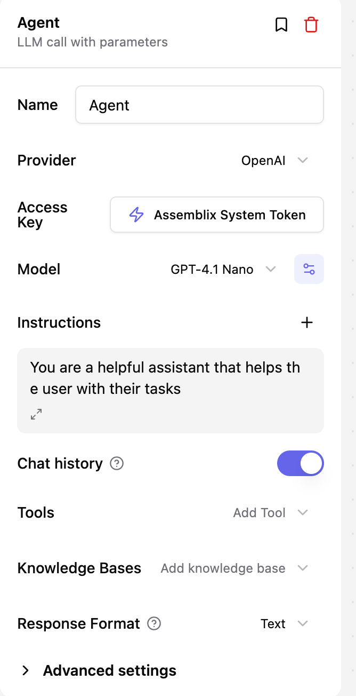
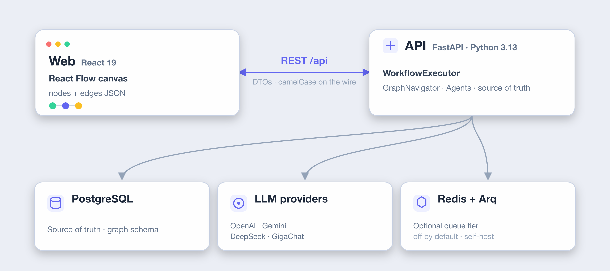

<div align="center">


### Build conversational AI agents — visually.

Design the whole dialogue as a graph, then run it as text, realtime voice, or a
lip-synced AI avatar — and let workflows score every conversation.
No glue code. Multi-LLM. Self-hostable. Source-available.

<!-- Badges -->
[](https://github.com/nmamizerov/assemblix/releases)
[](https://github.com/nmamizerov/assemblix/actions/workflows/ci.yml)
[](https://github.com/nmamizerov/assemblix/actions/workflows/web-ci.yml)
[][docs]
[](LICENSE.md)
[](https://github.com/nmamizerov/assemblix/stargazers)

**[▶ Try the live demo][demo]**  ·  **[📖 Documentation][docs]**  ·  **[🚀 Self-host](#-quickstart-1-minute)**  ·  **[⭐ Star us](https://github.com/nmamizerov/assemblix)**

<br/>

<!--
  HERO DEMO — the single most important asset on this page.
  Replace docs/assets/hero-placeholder.svg with the recorded GIF (docs/assets/hero.gif)
  once captured. See docs/assets/RECORDING.md for the shot list + processing pipeline.
-->
<a href="https://app.assmblx.com"></a>

</div>

---

**Assemblix** is a visual platform for building **conversational AI agents**. A dialogue
is not a wall of prompt text here — it is a directed graph of nodes on a
[React Flow](https://reactflow.dev) canvas (`START → AGENT → CONDITION → HTTP_REQUEST →
END`) that you can see, branch, and debug turn by turn. Agents call any of several LLM
providers, carry typed state across turns, answer from your own documents (RAG), and
reach external APIs mid-conversation.

How the agent *talks* is a separate layer from what it says. The same conversation can
run as **text**, as **realtime voice** that answers in about half a second, or as a
**lip-synced AI avatar** — and any conversation can have workflows attached that score
it, extract data from it, and push the result wherever you need. Run the whole thing on
your own infrastructure with a single `docker compose up`.

> **Source-available** (MIT + Commons Clause): free to use, modify, and self-host. The
> commercial billing/payments layer is under a separate Enterprise license and **off by
> default** — see [Licensing](#-license).

## Contents

- [✨ Why Assemblix](#-why-assemblix)
- [💡 What you can build](#-what-you-can-build)
- [🎧 Text, voice, avatar](#-text-voice-avatar)
- [📈 Every conversation, analyzed](#-every-conversation-analyzed)
- [🧩 Features](#-features)
- [🚀 Quickstart (1 minute)](#-quickstart-1-minute)
- [📸 Screenshots](#-screenshots)
- [🧱 How it works](#-how-it-works)
- [📦 Use it: Demo · Self-host · Enterprise](#-use-it)
- [🔌 Write your own nodes](#-write-your-own-nodes)
- [🤝 Contributing](#-contributing)
- [🔭 Releases & versioning](#-releases--versioning)
- [💬 Community & support](#-community--support)
- [🔒 Security](#-security)
- [📄 License](#-license)

## ✨ Why Assemblix

- **A dialogue is a graph, not a prompt.** Branch on what the user said, keep typed state
  across turns, call an API mid-conversation — and see the whole flow at a glance instead
  of guessing why one paragraph of instructions misfired.
- **One agent, three channels.** Text, realtime voice, and lip-synced avatar are layers on
  top of the same conversation — switch how the agent answers without rebuilding what it
  says.
- **Every conversation is analyzed.** Attach workflows to a running dialogue: they score
  it, pull out the fields you care about, write to your CRM, or raise an alert — in the
  background, while the conversation keeps going.
- **It remembers, and it knows your docs.** State lives in Postgres and survives restarts
  and deploys; knowledge bases ground answers in your own material, with citations.
- **Bring your own everything.** OpenAI · Gemini · DeepSeek for reasoning, OpenAI Realtime ·
  Gemini Live for speech-to-speech, ElevenLabs · Yandex SpeechKit for synthesis, Anam for
  avatars. Your keys, swappable, with retries and fallback built in.
- **Own your stack.** Self-host the entire thing with Postgres only; Redis + a worker queue
  tier are optional and opt-in. No vendor lock-in, no phone-home.
- **Production-minded & extensible.** SSRF-guarded HTTP node, secrets encryption,
  Prometheus metrics, and rate limiting ship in the box — and a new node type is a
  pip-installable package, auto-discovered with no core changes.

## 💡 What you can build

Anything shaped like a conversation that someone needs to act on afterwards.

| | | Layers |
|---|---|---|
| 📞 **Voice assistants** | Answer calls, book appointments, handle first-line support — the agent replies in about half a second, so it holds a real conversation instead of reading a script. | voice |
| 🎯 **Lead qualification** | Talk to the lead, then classify and score them in the background and push the result straight into your CRM. | text · voice · analysis |
| 💼 **Sales agents** | Walk a prospect through the pitch as a branching graph, and grade every conversation against your own criteria. | text · voice · analysis |
| 🏋️ **Employee training** | The agent plays the difficult customer; an analysis workflow scores how the rep handled it and shows the transcript back with the breakdown. | voice · avatar · analysis |
| 🎓 **Education & language practice** | Conversational drills and knowledge checks where the agent talks and a workflow marks the answers. | voice · avatar · analysis |
| 📋 **Interviews & surveys** | Run structured interviews or NPS calls, then extract structured answers from the transcript automatically. | voice · analysis |
| 📚 **Internal help desk** | Ground an agent on your own PDFs and Markdown and let staff ask it questions in chat or by voice. | text · voice |
| 🔌 **Agents inside your product** | Every workflow is a typed HTTP endpoint, and every voice agent has a session API — put the conversation behind your own UI. | text · voice |

## 🎧 Text, voice, avatar

The conversation is one thing; the channel it runs in is another. Assemblix keeps them
separate, so adding voice is a setting rather than a rewrite.

| Layer | What it is |
|---|---|
| **Text** | Chat sessions with history and state, plus a typed `POST /api/workflows/…` endpoint for your own front end. |
| **Voice in a workflow** | A `TRANSCRIBE` node takes speech as input; an `AGENT` node speaks its answer back, buffered or streamed live (ElevenLabs, Yandex SpeechKit). |
| **Realtime voice agents** | A prompt and a voice running directly against a speech-to-speech model — **no graph on the path to the reply**, so it answers in roughly half a second. |
| **AI avatars** | An agent's output drives a talking, lip-synced persona (Anam) — the same conversation, with a face. |

**Realtime voice agents** are the newest layer and deliberately *not* a graph. You write a
prompt, pick a voice, and the caller talks to the model directly:

| If you care most about | Choose |
|---|---|
| English conversations that feel natural to interrupt | **OpenAI Realtime** — the crispest barge-in handling |
| How the agent sounds in Russian or another non-English language | **Gemini Live** — markedly more natural across 70+ languages |

Knowledge bases are inlined into the prompt once when the call starts, so there is no
retrieval latency mid-call. Every call is recorded with its transcript, duration and cost,
and the same conversation is available over a public API — your backend mints a
short-lived session token, your front end streams audio over a WebSocket.

→ [Voice agents](docs/voice-agents/index.md) · [Providers](docs/voice-agents/providers.md) · [Integrating a call](docs/voice-agents/integrate.md)

## 📈 Every conversation, analyzed

This is where the graph engine reaches the dialogue. A conversation can start ordinary
workflows while it runs, and one more when it ends — extract the caller's details, score
the call against your criteria, write to a CRM, raise an alert.

Two rules hold: **the conversation never waits** (hooks run in the background), and **the
result does not come back** (hooks observe, they do not steer).

- **Per-turn hook** — fires on every finished thing the caller says, with the agent's
  previous reply for context.
- **Final hook** — fires once when the call ends, with the whole transcript.

```jsonc
// what the final hook receives
{
  "message": "user: hello\nassistant: hi, how can I help?\n…",
  "voice": {
    "session_id": "…",
    "transcript": [{ "role": "user", "text": "hello" }],
    "duration_sec": 74.2,
    "end_reason": "user_hangup"
  }
}
```

The workflows are normal workflows — nothing about them is voice-specific, and you run and
debug them by hand like any other. Every hook run is attached to the call that started it
and links straight into the execution viewer.

→ [Analysis hooks](docs/voice-agents/analysis.md)

## 🧩 Features

| | |
|---|---|
| 🎨 **Visual canvas** | Drag-and-drop dialogue editor (React Flow) with undo/redo, live debug panel, and per-node execution traces. |
| 🤖 **Multi-LLM agents** | `AGENT` nodes run tool-calling loops against OpenAI · Gemini · DeepSeek, with fallback and backoff. |
| 🎙️ **Realtime voice agents** | Speech-to-speech conversations on OpenAI Realtime or Gemini Live — sub-second replies, interruptible, recorded. |
| 🗣️ **Voice in workflows** | `TRANSCRIBE` node for speech input; agent voice output via ElevenLabs or Yandex SpeechKit, buffered or streamed. |
| 🧑‍💼 **AI avatars** | Drive a lip-synced talking persona (Anam) from an agent's output. |
| 📈 **Call analysis & scoring** | Per-turn and end-of-call workflow hooks that score conversations, extract fields, and hit your CRM — without blocking the dialogue. |
| 🔀 **Logic & control flow** | `CONDITION` (CEL expressions), `SET_VARIABLE`, and graph branching to build real decision logic. |
| 🌐 **HTTP & tools** | `HTTP_REQUEST` node with SSRF protection to call any external API as a tool. |
| 📚 **Knowledge bases (RAG)** | Attach document knowledge bases to agents for retrieval-augmented answers. |
| 🔑 **Workflow & voice APIs** | Every workflow is a typed HTTP endpoint; every voice agent has a token-based WebSocket session API. |
| 🏢 **Multi-tenancy** | Organizations, projects, credentials, and chat sessions out of the box. |
| 📊 **Observability** | Prometheus `/metrics`, `/health` + `/ready` probes, in-flight executions, per-step LLM token/cost metrics. |
| 🔌 **Node SDK** | Register custom nodes via an entry-point group — auto-discovered at startup. |

<div align="center">

**Bring your own providers**

<sub>**Reasoning** — OpenAI&nbsp;·&nbsp;Google Gemini&nbsp;·&nbsp;DeepSeek</sub><br/>
<sub>**Realtime speech** — OpenAI Realtime&nbsp;·&nbsp;Gemini Live</sub><br/>
<sub>**Speech synthesis & transcription** — ElevenLabs&nbsp;·&nbsp;Yandex SpeechKit</sub><br/>
<sub>**Avatars** — Anam</sub>

</div>

## 🚀 Quickstart (1 minute)

You need [Docker](https://docs.docker.com/get-docker/) with Compose v2 — that's it. The
bootstrap script checks Docker, generates the two required secrets, writes the root `.env`,
and brings the whole stack up.

**One line — clone, configure, and launch:**

```bash
curl -fsSL https://raw.githubusercontent.com/nmamizerov/assemblix/main/install.sh | bash
```

This installs the **latest release tag** (a stable, frozen snapshot). To pin a specific
version or track `main`, set `ASSEMBLIX_REF`:

```bash
curl -fsSL .../install.sh | ASSEMBLIX_REF=v0.1.3 bash   # a specific release
curl -fsSL .../install.sh | ASSEMBLIX_REF=main    bash   # bleeding edge
```

It asks one question — **Авто** (zero-config lean prod) or **Подробно** (pick mode, ports,
the Redis+worker queue tier, UI language, and optional LLM keys) — then does the rest. When
it finishes, open **http://localhost:8080**, create an account, and build your first workflow.

**Already cloned the repo?** From the repo root:

```bash
make setup        # or: ./setup.sh   (./setup.sh --auto skips all prompts)
```

<details>
<summary><b>Manual setup, development stack (live reload), native setup, and the queue tier</b></summary>

<br/>

**Manual setup** (what the script automates) — there's a **single `.env` at the repo root**
for the whole stack:

```bash
git clone https://github.com/nmamizerov/assemblix.git
cd assemblix
cp .env.example.quick .env      # then fill in the two required secrets (see below)
docker compose up -d --build    # web → http://localhost:8080 · api → http://localhost:8000
```

Generate the two required secrets and paste them into `.env`:

```bash
# JWT_SECRET_KEY  (min 32 chars)
python3 -c "import secrets; print(secrets.token_urlsafe(48))"
# ENCRYPTION_KEY  (Fernet key)
python3 -c "from cryptography.fernet import Fernet; print(Fernet.generate_key().decode())"
```

The backend **fails fast** without a valid `JWT_SECRET_KEY` and `ENCRYPTION_KEY`.

<br/>

**Dev — full stack with hot reload** (web on `:5173`, api on `:8000`):

```bash
cp .env.example .env            # dev template (fill JWT_SECRET_KEY + ENCRYPTION_KEY)
docker compose -f docker-compose.dev.yml up --build
```

The root `Makefile` wraps the common commands: `make dev`, `make prod`, `make down`,
`make logs`, and `make check` (runs the quality gates of both apps).

**Run natively (no Docker for the apps)** — start just Postgres in Docker, run each app on
the host (both read the same root `.env`):

```bash
docker compose -f docker-compose.dev.yml up -d postgres

# Backend (from assemblix-app-api/) → :8000
cd assemblix-app-api && uv sync && uv run alembic upgrade head && make dev

# Frontend (from assemblix-app-web/) → :5173, proxies /api → :8000
cd assemblix-app-web && yarn install && yarn dev
```

**Optional Redis + worker queue tier** (off by default — single-Postgres self-host is the
default). To enable distributed execution, set in `.env`:

```bash
COMPOSE_PROFILES=queue
REDIS_URL=redis://redis:6379/0
EXECUTION_QUEUE_ENABLED=true
```

then `docker compose up -d`. Full configuration reference lives in the [docs][docs].

</details>

## 📸 Screenshots

| Visual canvas | Live execution & debug |
|:---:|:---:|
|  |  |
| **Execution traces & state** | **Knowledge bases (RAG)** |
|  |  |
| **Chat sessions** | **Agent configuration** |
|  |  |

<!--
  MISSING SHOTS — the voice/avatar layers are not represented above yet.
  Capture and drop into docs/assets/, then add rows here:
    voice_agent.png     — the voice agent editor (prompt, provider/voice picker, knowledge)
    voice_calls.png     — the Calls tab: transcript, duration, cost, linked analysis runs
    voice_analysis.png  — analysis hooks attached to an agent (per-turn + final workflow)
    avatar.png          — an agent answering as a lip-synced avatar
-->

## 🧱 How it works

<p align="center">
  
</p>

The frontend canvas produces the nodes-and-edges JSON; the backend is the source of truth
for the node-graph schema and executes it. Deep dive in the
per-app guides ([backend](assemblix-app-api/CLAUDE.md) · [frontend](assemblix-app-web/CLAUDE.md)).

## 📦 Use it

<table>
<tr>
<td width="33%" valign="top">

### ▶ Live demo
The fastest way to try it — no install.

**[Open the demo →][demo]**

</td>
<td width="33%" valign="top">

### 🚀 Self-host
One `docker compose up`, your infra, your keys.

**[Quickstart →](#-quickstart-1-minute)**

</td>
<td width="33%" valign="top">

### 🏢 Enterprise
Billing/payments layer (separate EE license), off by default.

**[Licensing →](#-license)**

</td>
</tr>
</table>

## 🔌 Write your own nodes

Nodes register by string type and are auto-discovered at startup via the `assemblix.nodes`
entry-point group — no core changes, no DB migration. New node types round-trip safely
through a generic schema fallback. See the
[node-authoring guide](internal-docs/CONTRIBUTING_NODES.md) for a worked example and packaging steps.

## 🤝 Contributing

Contributions are welcome — bug reports, features, docs, and new node types. Start with
[CONTRIBUTING.md](CONTRIBUTING.md) for setup, the quality gates (`make check`), and
conventions, and our [Code of Conduct](CODE_OF_CONDUCT.md). This project uses
[Conventional Commits](https://www.conventionalcommits.org) — see
[Releases & versioning](#-releases--versioning).

<a href="https://github.com/nmamizerov/assemblix/graphs/contributors">
  
</a>

## 🔭 Releases & versioning

Assemblix follows [Semantic Versioning](https://semver.org) with `vX.Y.Z` git tags and
[GitHub Releases](https://github.com/nmamizerov/assemblix/releases). Releases are automated
with [release-please](https://github.com/googleapis/release-please): merged
[Conventional Commits](https://www.conventionalcommits.org) on `main` keep a **release PR**
open that bumps the version (root manifest + `pyproject.toml` + `package.json` in lockstep)
and regenerates the [CHANGELOG](CHANGELOG.md); merging it cuts the tag and Release. Browse
or pin a version with `git checkout v0.1.0`, or via the **Releases** / **Tags** tab.

## 💬 Community & support

- 🐛 **Found a bug / want a feature?** Open an [issue](https://github.com/nmamizerov/assemblix/issues).
- 💡 **Questions & ideas:** [GitHub Discussions](https://github.com/nmamizerov/assemblix/discussions).
- 📖 **Docs:** [the documentation site][docs].

If Assemblix is useful to you, a ⭐ helps others find it.

<a href="https://star-history.com/#nmamizerov/assemblix&Date">
  
</a>

## 🔒 Security

Please report vulnerabilities privately — see [SECURITY.md](SECURITY.md). Do not open public
issues for security problems.

## 📄 License

Source-available under **MIT + Commons Clause** ([LICENSE.md](LICENSE.md)) — free to use,
modify, and self-host; you may not sell it or offer it as a paid hosted/managed service. A
small set of files (payments / acquiring) is under a separate **Enterprise license**
([LICENSE_EE.md](LICENSE_EE.md)) and is disabled by default for self-hosting
(`BILLING_ENABLED=false`). Third-party attributions are in [NOTICE](NOTICE).

<!--
  Reference links — the live demo + docs URLs live here in one place.
-->
[demo]: https://app.assmblx.com
[docs]: https://app.assmblx.com/docs
