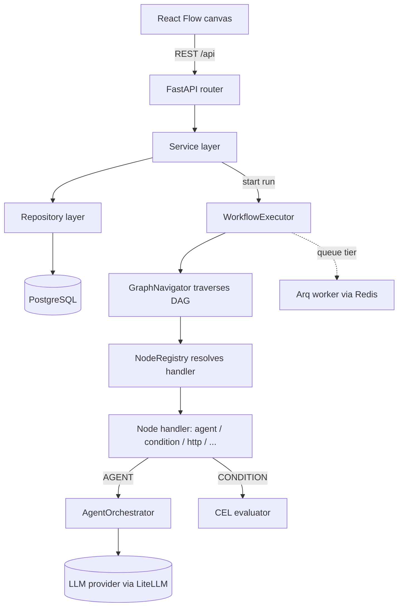

# Architecture

Assemblix is a single repository holding two independently-built applications:

- **Backend** — `assemblix-app-api/`: FastAPI (Python 3.13, async SQLAlchemy, PostgreSQL).
- **Frontend** — `assemblix-app-web/`: React 19 + Vite (TypeScript, Feature-Sliced Design).

The two are separate toolchains (uv/pytest vs npm/vite); run commands from inside the
respective directory.

## How the two halves connect

- The frontend talks to the backend over a **REST API**. In dev, Vite proxies `/api/`
  requests to the backend at `http://localhost:8000`.
- The **API is the source of truth for the node graph schema**; the React Flow canvas
  produces the nodes + edges JSON that the backend executes. Changing a node type means
  changing both sides (backend handler/registry + frontend node UI).
- **DTOs are camelCase on the wire** — the backend auto-converts snake_case ↔ camelCase via
  `DTOModel` aliasing, so frontend types stay camelCase.

## Request and execution flow



In the optional queue tier the API enqueues the run to Redis and an Arq worker executes the
graph; otherwise execution runs in-process.

## Backend: 4-layer architecture

`API → Service → Repository → Model`

- **`api/rest/`** — FastAPI routers. HTTP contract only, no business logic; uses `Depends()`
  for DI.
- **`services/`** — business logic. Receives repositories via `__init__`; inherits
  `BaseService[Model, Repository]`. No SQLAlchemy queries here.
- **`database/repositories/`** — DB operations only; inherits `BaseRepository[ModelType]`.
  No business logic, no HTTP concepts, no `HTTPException`.
- **`database/models/`** — SQLAlchemy ORM models (`UUIDMixin`, `TimestampMixin`, `Base`).
- **`dto/`** — Pydantic DTOs (`requests/`, `responses/`), all inheriting `DTOModel`. DTOs are
  always used between layers; raw dicts are not passed across boundaries.
- **`dependencies.py`** — all DI wiring (`get_db_session` → repositories → services).

### Workflow execution engine

- **`nodes/`** — node handler classes, registered in the `NodeRegistry` singleton at startup.
- **`execution/`** — `WorkflowExecutor` orchestrates a run; `GraphNavigator` traverses the
  DAG; `AgentOrchestrator` runs LLM agent loops; `ToolExecutor` runs tools.
- **`core/cel_evaluator.py`** — CEL expression evaluator for condition nodes.
- **`core/node_registry.py`** — singleton mapping node types (string) to handler classes.

Nodes register by string type via `@register_node("type")`. The `node_type` column is a
plain `VARCHAR`, so new node types need no DB migration, and unknown types round-trip safely
through a generic fallback. Out-of-tree node packages are auto-discovered via the
`assemblix.nodes` entry-point group. See [CONTRIBUTING_NODES.md](CONTRIBUTING_NODES.md).

### LLM integration

Providers (OpenAI, Gemini, DeepSeek) are reached through LiteLLM. Auth is JWT plus
API keys (prefixed `sk_`), with optional Google/GitHub OAuth.

## Frontend: Feature-Sliced Design

Strict FSD with unidirectional dependencies: `app → pages → features → entities → shared`.
Importing from a higher layer is forbidden.

```
src/
  app/        — providers, router, store, layouts
  pages/      — one per route, compose entities & features
  features/   — reusable business features
  entities/   — domain models: workflow, session, credential, execution, knowledge-base, …
  shared/     — base API, config, i18n, lib utils, UI components
```

Each slice exposes a public API via `index.ts` (the only import point), with `api/` (RTK
Query endpoints), `model/` (types + Redux slices), `ui/` (components), and `lib/` (hooks).
State is Redux Toolkit + RTK Query; the canvas uses React Flow (`@xyflow/react`).

## Optional queue tier

Redis and the Arq worker are opt-in (see [self-hosting](self-hosting.md)). With
`EXECUTION_QUEUE_ENABLED=true` and a `REDIS_URL`, the API enqueues runs and one or more Arq
worker processes execute them; debug events and execution checkpoints can also flow through
Redis. The default self-host build runs everything in a single process against one Postgres.
