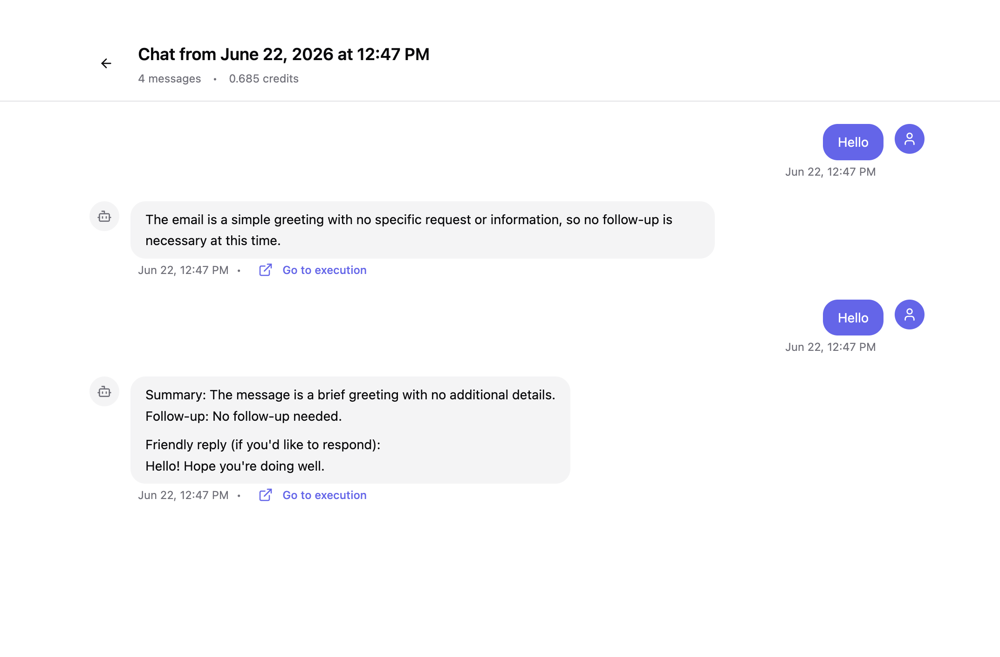

# Assemblix

**Assemblix** is a visual builder for **conversational AI agents**. You wire typed nodes
into a directed graph on a [React Flow](https://reactflow.dev/) canvas, then run it as a
conversation — with text, **voice**, or a talking **AI avatar** on either end. Alongside
graph workflows it runs **realtime voice agents**: speech-to-speech conversations that
answer in about half a second, with workflows attached to score and analyze every call.

## Chat-first by design

A workflow in Assemblix is something you *talk to*. Runs are conversational: a chat
**session** keeps history and state across turns, the `START` node can greet the user with a
first phrase, and each turn flows through your graph — agents, conditions, HTTP calls — until
an `END` node produces the reply.

- **Voice input** — the `START` node can accept an audio blob and transcribe it server-side
  (speech-to-text), so a spoken message drives the workflow just like typed text.
- **Voice output** — an `AGENT` node can speak its answer back as synthesized audio, either
  buffered at the end of the turn or streamed in real time.
- **AI avatars** — an agent's output can drive a talking avatar persona, turning a workflow
  into a face-to-face conversation.

## Realtime voice agents

A **voice agent** is not a workflow: no canvas, no nodes. You write a prompt, choose a
voice, and the caller talks to a speech-to-speech model directly — which is why it answers
fast enough to interrupt. Workflows reach the conversation as **analysis hooks**: they run
in the background on every turn and once at the end, scoring the call, extracting fields,
or writing to a CRM.

- **[Voice agents](voice-agents/index.md)** — what you configure, calls, and costs.
- **[Providers](voice-agents/providers.md)** — OpenAI Realtime vs Gemini Live, honestly.
- **[Analysis hooks](voice-agents/analysis.md)** — scoring and extracting from a live call.
- **[Integrating a call](voice-agents/integrate.md)** — the session-token + WebSocket protocol.

## What you can build

Lead qualification and scoring, voice assistants that take calls, sales agents graded
against your own criteria, employee training where the agent plays the customer, language
practice and knowledge checks, structured interviews and surveys, and internal help desks
grounded on your own documents.

## What else is in the box

- **Multiple LLM providers** — OpenAI, Gemini, DeepSeek, with fallbacks and per-credential
  routing.
- **Tools & MCP** — give agents tools and Model Context Protocol servers to act, not just
  answer.
- **Knowledge bases (RAG)** — upload documents and ground agents on them.
- **Branching & state** — route on CEL conditions and read/write a shared variable scope
  across the run.
- **Credentials & multi-tenancy** — encrypted-at-rest secrets, scoped to organizations and
  projects.

## Get going

- **[Get started](get-started.md)** — dependencies, the example Docker Compose files, and
  how to run a self-hosted instance.
- **[Creating workflows](workflows/nodes.md)** — the node types, how execution works, and
  how to debug a run.

## License

Source-available under **MIT + Commons Clause** — free to use, modify, and self-host; you
may not sell it or offer it as a paid hosted/managed service. A small set of files
(payments / acquiring) is under a separate **Enterprise license** and is disabled by
default for self-hosting (`BILLING_ENABLED=false`). See the `LICENSE.md` and `LICENSE_EE.md`
files in the repository.
