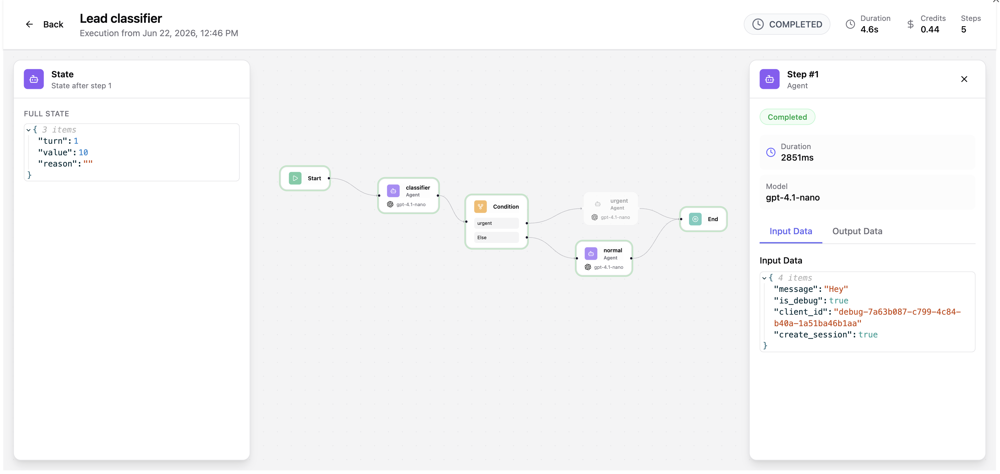

# Debugging

While a normal run gives you only the final answer, **debug mode** lets you watch a workflow
execute **step by step from the editor** — node events stream in live, you can inspect each
node's input/output and the run's state as it changes, and edit the initial state before you
run. It's how you build and troubleshoot a workflow before exposing it.

Debug runs are special in three ways: they're flagged `is_debug`, they're **unbilled** (no
credits consumed), and they're **hidden** from the normal executions list — so you can iterate
freely without polluting your run history.



## Running in debug

A debug run streams its events as they happen instead of returning a single response at the
end:

```
POST /api/workflows/{workflowId}/execute/debug        # returns text/event-stream (SSE)
POST /api/workflows/{workflowId}/execute/debug/audio  # same, with voice input
```

The response is a **Server-Sent Events (SSE)** stream — a long-lived connection over which the
server pushes one event per thing that happens. Each event carries a monotonically increasing
`seq` used as the SSE `id:`, so if the connection drops you can resume from exactly where you
left off (send the last `seq` back as `Last-Event-ID`). The event types:

| Event | When it fires | Key payload |
| --- | --- | --- |
| `step_start` | A node begins running | node id/type, the input it received, state before |
| `step_complete` | A node finishes | node output, status, state after, timing, model/tokens/cost |
| `stream_delta` | An agent emits a token chunk | the `delta` text (with an `avatar` flag when driving an avatar) |
| `audio_delta` | A voice-output audio chunk is ready | base64 PCM audio + optional `alignment` timing for lip-sync |
| `execution_complete` | The run finished | final `output`, final state, total steps/credits/duration |
| `error` | The run failed | error message, type, and the node that failed |

This is the same event stream produced by a regular run started with `stream: true` (see
[Executing workflows → Streaming](execute.md#streaming-token-by-token)); debug mode simply
turns it on automatically and adds step-level detail.

## In the editor

You rarely handle the raw SSE stream yourself — the editor's **debug panel** consumes it and
turns it into an interactive view:

- **Run + live chat** — type (or speak) an input and watch the conversation stream back turn
  by turn, exactly as an end user would experience it.
- **Per-node step trace** — expand any node to see the exact input it received and the output
  it produced, so you can pinpoint where a run went wrong.
- **State editor** — inspect and edit the initial (and current) shared state before and while
  running, to reproduce a specific scenario without wiring up upstream nodes.
- **Live canvas status** — nodes light up with their status (running, done, failed) as
  execution moves through the graph, giving you an at-a-glance view of the flow.

## Replay and run history

Debug mode is for live iteration; once a workflow is running for real, you'll want to review
past runs and monitor active ones. Three endpoints cover that:

- **Attach to a run's live stream** — `GET /api/executions/{executionId}/stream` subscribes to
  any execution's event stream, replaying from a `Last-Event-ID` cursor and then tailing live.
  Use it to reconnect a UI to an in-progress run.
- **See what's running now** — `GET /api/executions/in-flight` lists every `RUNNING` /
  `QUEUED` execution, for a live monitoring view.
- **Inspect finished runs** — `GET /api/executions` returns run history (paginated and
  filterable by workflow, session, client, status, or date), and
  `GET /api/executions/{executionId}` returns the full detail of a single run: every
  `ExecutionStep` with its inputs, outputs, status, and the state snapshots. The **execution
  viewer** in the UI is built on these endpoints.


